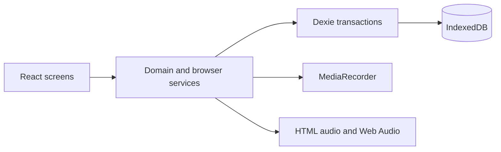

# Japanese Pronunciation Lab

A private, offline-first workspace for mining short Japanese sentences and comparing your
pronunciation with a local reference clip.

The first milestone supports this complete loop:

```text
Create a source → save a sentence and timestamps → add a reference clip
→ record yourself → alternate playback → save multiple attempts
```

Recordings and reference clips stay in IndexedDB on the current device. The app does not upload
audio or attempt to download audio from YouTube.

## Features

- Sources for YouTube videos, uploaded media, podcasts, and manual study sets
- Japanese sentence, reading, translation, transcript status, tags, speaker, and timestamps
- YouTube timestamp mining (playback only) and WebVTT/SRT subtitle import
- Local media upload with waveform region clipping into short reference WAV clips
- One local reference clip per sentence
- Safari-compatible microphone recording with runtime MIME negotiation and optional calibration
- Multiple learner attempts with notes, manual ratings, favorites, and immediate replay
- Alternate playback, speed controls, chunk practice, and editable mora timing guides
- Local waveform comparison, YIN pitch contours, and confidence-labeled timing observations
- Library filters (search, type, reference presence, needs review)
- Metadata JSON and full media ZIP export/import
- Installable PWA shell and offline access to previously saved local data
- Mobile-first controls, safe-area support, keyboard focus, reduced motion, and high contrast

YouTube audio is never downloaded. Pitch/waveform analysis requires a local reference clip.

## Local development

Requirements:

- Node.js 22 or newer
- npm

```bash
npm install
npm run dev
```

Vite prints the local URL. Microphone recording works on `localhost`; testing from another device
requires HTTPS because browsers restrict microphone access to secure contexts.

Verification:

```bash
npm test
npm run lint
npm run build
npm run preview
```

## GitHub Pages deployment

The repository includes [`.github/workflows/deploy.yml`](.github/workflows/deploy.yml). In the
GitHub repository:

1. Open **Settings → Pages**.
2. Set **Source** to **GitHub Actions**.
3. Push `main`, or run **Deploy to GitHub Pages** from the Actions tab.

The app uses relative Vite asset paths and hash routing, so it works at a GitHub Pages project
subpath without server rewrites.

## Architecture

The application is a static React SPA. UI components call domain services; services own
cross-record rules and use Dexie transactions; repositories and the database module own
IndexedDB access.



Data is deliberately normalized:

- `sources` hold provenance.
- `sentences` hold transcript and source timestamps.
- `audioAssets` hold immutable Blobs.
- `referenceAudio` links one reference asset to a sentence.
- `attempts` link learner assets to practice history.
- `derivedAnalyses` is reserved for versioned, recomputable analysis data.

Deleting an attempt transactionally deletes its owned audio asset. Deleting a reference clip
retains the sentence and source timestamps. Object URLs are created only while a player needs
them and are never persisted.

### Technology choices

- React 19, TypeScript, and Vite
- React Router hash routing for static hosting
- Dexie 4 and `dexie-react-hooks` for typed IndexedDB and live queries
- MediaRecorder and native audio elements for the first milestone
- `vite-plugin-pwa` for the service worker and manifest
- Vitest, Testing Library, and `fake-indexeddb`

wavesurfer.js is deferred until waveform selection/comparison is implemented. `ffmpeg.wasm` is not
included due to its mobile download, startup, and memory costs. A later full-media backup can use
`fflate`; the current JSON export is clearly metadata-only.

## IndexedDB schema

| Store | Purpose | Important indexes |
|---|---|---|
| `sources` | Source title, type, URL, creator, notes | type, title, updated time |
| `sentences` | Transcript, timestamps, tags, reference link | source, updated time, tags |
| `audioAssets` | Reference and attempt Blobs | kind, created time |
| `referenceAudio` | One local reference per sentence | unique sentence and asset |
| `attempts` | Learner recording history | sentence, unique asset, created time |
| `derivedAnalyses` | Future versioned analysis output | attempt, kind, algorithm version |

Schema upgrades must remain deterministic. Expensive audio decoding or analysis must happen
outside IndexedDB upgrade transactions.

## Browser and iOS Safari limitations

- Safari normally records AAC in MP4; Chromium commonly records Opus in WebM. The app probes
  `MediaRecorder.isTypeSupported()` instead of hardcoding one format.
- Microphone permission and audio playback require an explicit user gesture. Recording requires
  HTTPS except on localhost.
- Safari may suspend audio when the app is backgrounded. Practice controls are foreground-only.
- IndexedDB is best-effort and can be evicted. A Safari tab that is not revisited may also lose
  script-written storage under tracking-prevention rules. Add the app to the Home Screen and keep
  backups.
- iOS does not provide Chromium's File System Access API. Import uses a file input; export uses a
  normal browser download.
- A YouTube iframe cannot expose arbitrary audio to Web Audio analysis. Future YouTube support is
  timestamp/playback only; analysis will continue to require local media.
- The current metadata JSON backup does **not** contain reference clips or learner recordings.

## Privacy

There is no account, backend, analytics service, or remote audio processor. Audio remains on the
device unless a future export feature is explicitly used. Any future cloud analysis must disclose
and request consent before uploading audio.

## Tests

The core suite proves:

- Timestamp validation and normalized source/sentence creation
- IndexedDB persistence and schema v2 stores
- Atomic attempt/audio ownership and deletion
- Metadata round-trip, dangling-reference rejection, and collision handling
- MediaRecorder MIME fallback selection
- WebVTT/SRT parsing, YouTube ID extraction, mora seeding, and onset detection helpers

Automated browser emulation cannot prove iPhone microphone hardware behavior. Before relying on the
deployed app, manually verify on current iPhone and iPad Safari: permission denial/retry, AAC
recording, large-media clipping under memory pressure, YouTube mining, ZIP export/import, Home
Screen launch, and storage-pressure messaging.

## Review order

1. [`src/main.tsx`](src/main.tsx) and [`src/App.tsx`](src/App.tsx) — entry point and routes
2. [`src/db/schema.ts`](src/db/schema.ts) — persisted model
3. [`src/services/index.ts`](src/services/index.ts) — invariants, recording, playback, transfer
4. [`src/pages/LibraryPage.tsx`](src/pages/LibraryPage.tsx) → [`src/pages/SourcePage.tsx`](src/pages/SourcePage.tsx) → [`src/pages/SentencePage.tsx`](src/pages/SentencePage.tsx) — core workflow
5. [`src/pages/SettingsPage.tsx`](src/pages/SettingsPage.tsx) — storage and metadata backup
6. [`src/services/services.test.ts`](src/services/services.test.ts) — persistence guarantees

## Access

After GitHub Pages is enabled for this repository, the live app is:

**https://efancher.github.io/shadowing/**

Local development remains available with `npm run dev`.