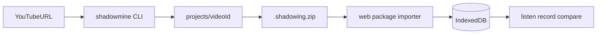

# Japanese Shadowing Lab

Personal Japanese pronunciation / shadowing toolkit with two cooperating parts:

1. **Desktop CLI (`shadowmine`)** — fetch source audio, process subtitles, mine lines, clip AAC/M4A references, export a portable `.shadowing.zip`
2. **Practice web app** — import packages, listen, record, compare, and keep practice history on-device

They communicate only through the versioned package format `japanese-shadowing-package` v1.

Live practice app: https://efancher.github.io/shadowing/

## Repository layout

```text
shadowing/
├── cli/                 # Python shadowmine
├── web/                 # React practice app (Vite)
├── schemas/             # shared JSON Schema + fixtures
├── examples/            # example .shadowing.zip
└── .github/workflows/   # Pages + CI
```

## Package format

A `.shadowing.zip` contains:

```text
manifest.json
source.json
sentences.json
audio/sentence-001.m4a
subtitles/ja.vtt   # optional
```

Schema: [`schemas/shadowing-package.schema.json`](schemas/shadowing-package.schema.json)  
Example: [`examples/example.shadowing.zip`](examples/example.shadowing.zip)

## Desktop CLI

Requires Python 3.11+, `ffmpeg`, `ffprobe`, and `yt-dlp` (Python package).

```bash
cd cli
python -m venv .venv
source .venv/bin/activate
pip install -e ".[dev]"
shadowmine --help
```

Recommended guided flow:

```bash
shadowmine create "https://www.youtube.com/watch?v=…"

# Or accept every cleaned subtitle cue without prompts:
shadowmine create "https://www.youtube.com/watch?v=…" -y
```

This fetches audio and subtitles, opens the interactive sentence miner, then
exports and validates the `.shadowing.zip` package. The individual `inspect`,
`fetch`, `subtitles`, `mine`, `clip`, `export`, and `validate` commands remain
available for step-by-step use. English subtitles are fetched and aligned by
timestamp when available. See the [CLI guide](cli/README.md) for the full
workflow and web import instructions.

**Legal / ToS:** You are responsible for lawful download and use of any media. This tool does not bypass DRM, login walls, or age restrictions.

### Missing dependency hints

| Tool | macOS | Windows | Debian/Ubuntu |
|---|---|---|---|
| ffmpeg / ffprobe | `brew install ffmpeg` | `winget install Gyan.FFmpeg` or Scoop | `sudo apt install ffmpeg` |
| Python deps | `pip install -e .` in `cli/` | same | same |

## Practice web app

```bash
cd web
npm ci
npm run dev
```

Tests / production build:

```bash
cd web
npm test
npm run build
```

GitHub Pages deploys `web/dist` with `base: "./"` and a hash router, so the public URL stays under `/shadowing/`.

## Workflow



- Desktop CLI: download, parse, trim, package
- Web app: import, listen, record, compare, repeat

Learner recordings never leave the device unless you explicitly export a backup from Settings.
